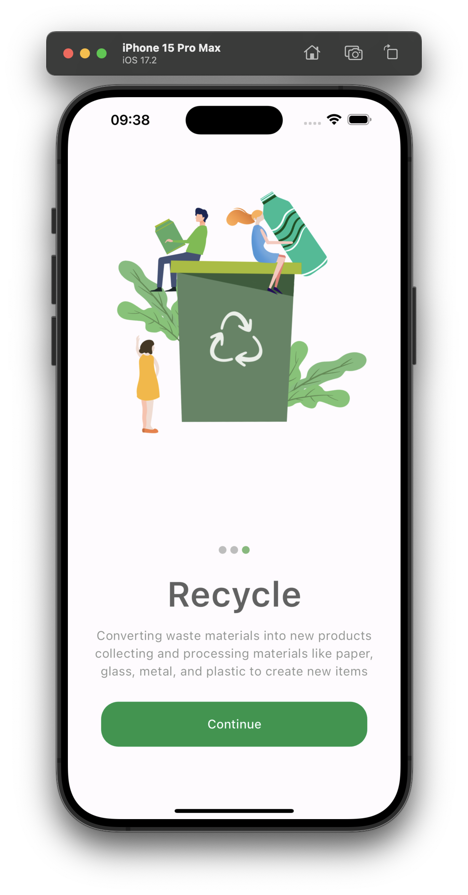
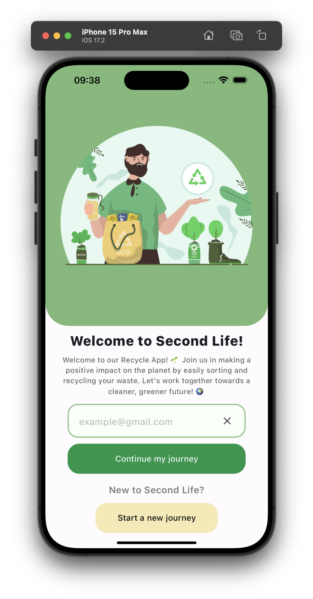
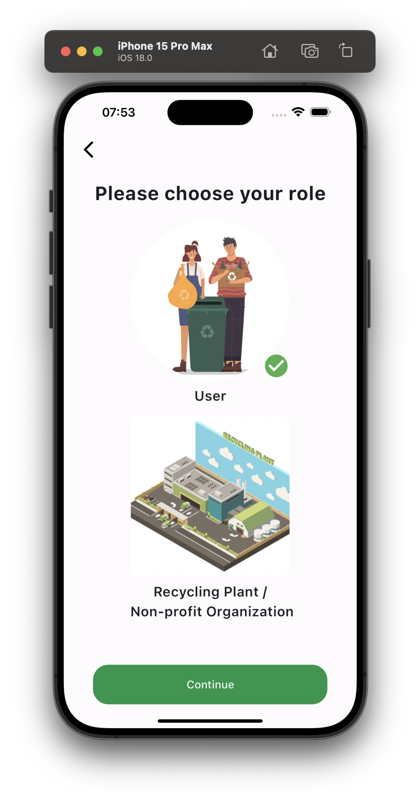
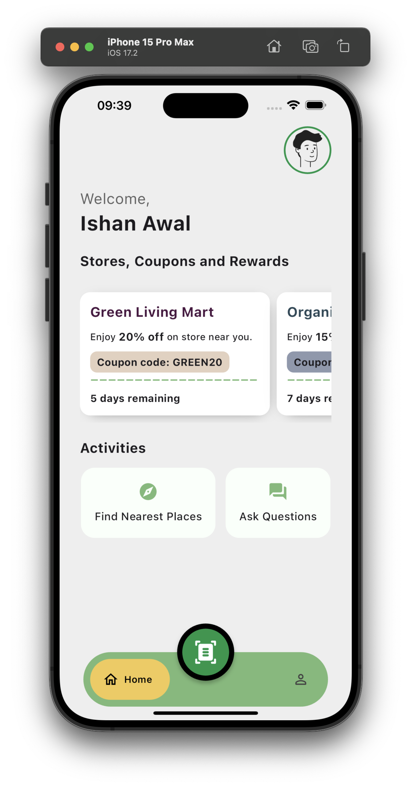
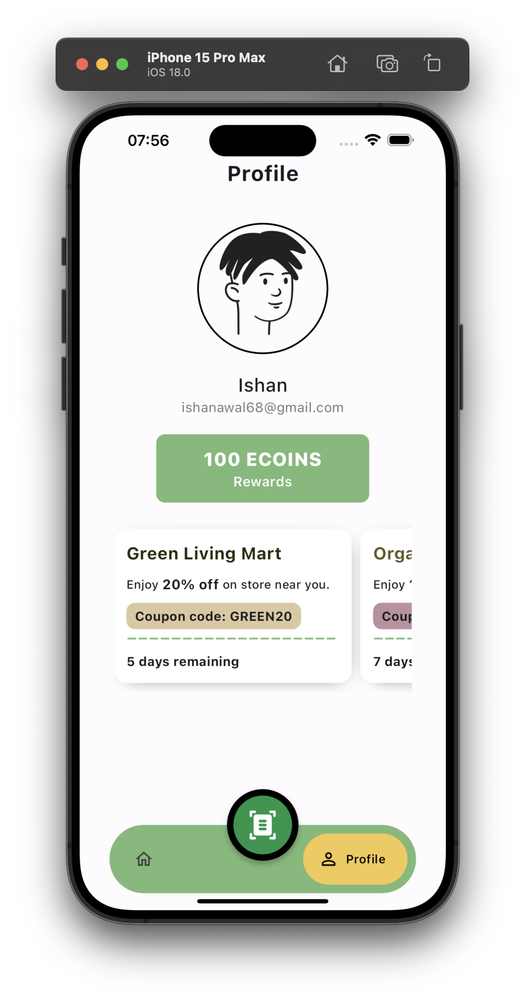

# Second Life

Second Life is a mobile application developed using Flutter aimed at promoting recycling. The app facilitates users in recycling items efficiently and conveniently. The project currently includes the frontend development with several key screens.

## Screenshots

### Splash Screen
<p align="center">
  
</p>

### Login Screen
<p align="center">
  
</p>

### Role Selection Screen
<p align="center">
  
</p>

### Home Screen
<p align="center">
  
</p>

### Profile Screen
<p align="center">
  
</p>


## Getting Started

To get a local copy up and running follow these simple steps.

### Prerequisites

- Flutter SDK: [Install Flutter](https://flutter.dev/docs/get-started/install)

### Installation

1. Clone the repo
     ```sh
     https://github.com/Codewire-github/SecondLife-front.git

2. Navigate to the project directory
      ```sh
      cd second-life
3. Install dependencies
      ```sh
      flutter pub get
4. Run the app
      ```sh
      flutter run

